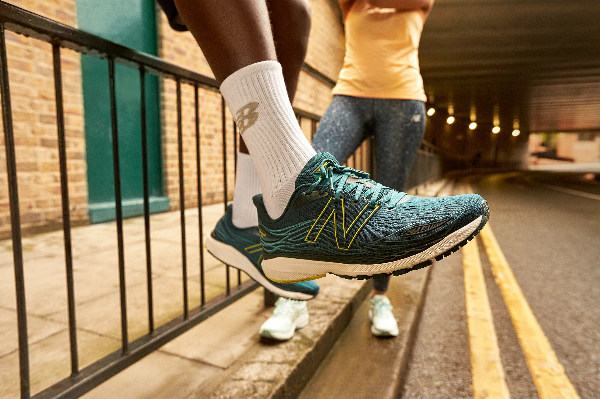

## The People's Kitchen of San Luis Obispo, CA

```{=html}
<div style="display: flex; align-items: center;">
  <div style="flex: 1;">
    <p><strong>Description:</strong> Working alongside Assistant Professor of Statistics Dr. Emily Robinson to digitize, create a data workflow, analyze, and produce dashboards to visualize data, specifically the number of meals served, for the local food kitchen.
    <p>Our work was featured in the <a href="https://statistics.calpoly.edu/news/stats-students-improve-meal-service-tracking-local-nonprofit" target="_blank">2024 Statistics Department newsletter</a> and the <a href="https://cosam.calpoly.edu/Intersections-2024" target="_blank">Cal Poly Bailey College of Science and Mathematics 2024 Intersections Magazine</a> (pg. 16-17).</p>
  </div>
  <div style="flex: 1; text-align: right;">
    
  </div>
</div>
```
## Speed and Footwear Experiment

```{=html}
<div style="display: flex; align-items: center;">
  <div style="flex: 1;">
     <p style="margin: 0;"><strong>Description:</strong> STAT 365 - Statistical Communication project. Designed and carried out a fully randomized experiment to test if the type of footwear affects the speed of a single runner.</p>
    <p style="margin: 0;"><strong>GitHub Link:</strong> <a href="https://github.com/edyrey/stat365_project">STAT 365 Project</a></p>
  </div>
  <div style="flex: 1; text-align: right;">
    
  </div>
</div>
```
## Recall of Words Experiment

```{=html}
<div style="display: flex; align-items: center;">
  <div style="flex: 1;">
    <p style="margin: 0;"><strong>Description:</strong> STAT 323 - Design and Analysis of Experiments final project. Designed and carried out a repeated measures experiment to examine the effect of organizational patterns (ordered, random) and sound conditions (silence, white noise, music) on an individual’s ability to remember simple words. </p>
    <p style="margin: 0;"><strong>GitHub Link:</strong> <a href="https://github.com/edyrey/stat323_finalproject">STAT 323 Final Project</a></p>
  </div>
  <div style="flex: 1; text-align: right;">
    
  </div>
</div>
```
## Survival Analysis of Tree Saplings

```{=html}
<div style="display: flex; align-items: center;">
  <div style="flex: 1;">
    <p style="margin: 0;"><strong>Description:</strong> STAT 417 - Survival Analysis Methods final project. Sourced data from a factorical blocked design field experiment to examine tree seedling survival. </p>
    <p style="margin: 0;"><strong>GitHub Link:</strong> <a href="https://github.com/edyrey/stat417_finalproject">STAT 417 Final Project</a></p>
  </div>
  <div style="flex: 1; text-align: right;">
    
  </div>
</div>
```
## Prostate Cancer Prognosis Data Analysis

```{=html}
<div style="display: flex; align-items: center;">
  <div style="flex: 1;">
    <p style="margin: 0;"><strong>Description:</strong> STAT 418 - Categorical Data Analysis final project. Using prostate cancer clinical variables to predict capsular penetration.  </p>
    <p style="margin: 0;"><strong>GitHub Link:</strong> <a href="https://github.com/edyrey/stat418_finalproject">STAT 418 Final Project</a></p>
  </div>
  <div style="flex: 1; text-align: right;">
    
  </div>
</div>
```
## Automated Financial Data Warehouse (Python & Google Suite)

```{=html}
<div>

  <!-- Image floated left -->
  

  <!-- Text that should sit next to the image -->
  <p style="margin: 0;"><strong>Tools:</strong> Python (pandas), Codex, Google Apps Script, Google Sheets, Excel, Google Drive</p>
  <p style="margin: 0;"><strong>Focus:</strong> Data automation, ETL design, workflow migration, reproducible local analytics</p>

  <p>
    This project began as a Python workflow to automate monthly financial reporting, then shifted into Google Suite
    while I built out the process in tools I already knew well. As the project matured and I started exploring Codex,
    I transitioned the workflow back into Python to build a more maintainable local data warehouse.
  </p>

  <!-- Content that should flow BELOW the image -->
  <div style="clear: both;"></div>

  <p style="margin-bottom: 5px;"><strong>Project evolution:</strong></p>
  <ul style="margin-top: 0;">
    <li>Started in Python as an automated parser for multi-sheet income statements and GL-based record standardization</li>
    <li>Moved into Google Suite using Apps Script and Google Sheets to support a more familiar and accessible workflow</li>
    <li>Now being rebuilt in Python with Codex support to create a cleaner local warehouse and more reproducible ETL process</li>
  </ul>

  <p>
    Across each version, the core goal has stayed the same: transform inconsistent financial files into standardized,
    deduplicated records that support reliable downstream reporting and analysis.
  </p>

  <p style="margin: 0;">
    <strong>GitHub Link:</strong>
    <a href="https://github.com/edyrey/financial_data_warehouse_automation/tree/main">
      Automated Financial Data Warehouse Project
    </a>
  </p>

</div>
```
